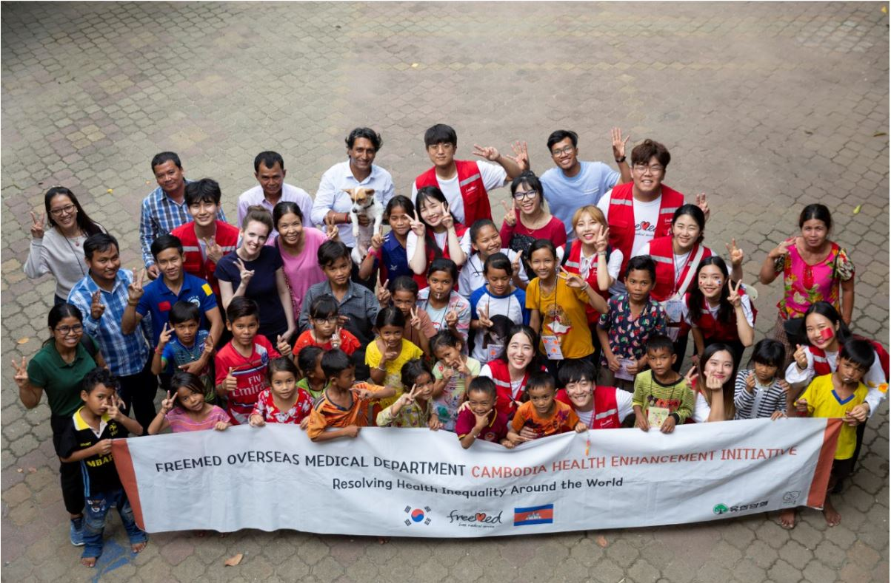

# 해외의료사업본부

## 본부소개
***'Resolving Health Inequality Around the World'***

해외의료사업본부는 *‘전세계 건강 불평등 해소’* 라는 슬로건을 가지고, 다양한 전공의 20대의 청년들이 모여 사업의 기획부터 실행까지 파견의 모든 과정을 함께 밟아가는 본부입니다. 

저마다의 능력을 가진 청년들이 모이기에 파견동안의 적응력, 순발력, 끈기 뿐만 아니라 파견 전까지의 준비과정에서 꼼꼼함, 추진력, 팀워크 역시 맘껏 발휘할 수 있는 곳입니다.

## 사업소개

### 2012년 케냐 모성건강증진 사업 (Maternal Healthcare Initiative, MHI in Kenya)

임신과 출산으로 인한 모성사망률 감소를 위해 체계적 교육 실시 및 응급 구호 물품 보급

* 2012.01 산모후송 구급차량 케냐 카지아도 내 4개 지역 총 7량 보급, 산전검진도구키트와 출산키트 개발 및 카지아도 내 26개 지역 총 30개 키트 보급

* 2012.08. 케냐 보건후생부 표창 수상

* 2015.01. 산모후송 구급차량 케냐 로이토키톡 지역 2량 보급 및 카지아도 내 26개 지역 의료인 및 보건공무원 교육 

### 2016년 필리핀 모성건강증진 사업 (Philippines Healthcare Initiative, PHI)

* 2016.10. 시범 파견 메트로 마닐라 지역 주민 성교육 진행 및 메트로 마닐라 지역 주민 대상 필리핀 성 인식 수준과 교육 실태 인터뷰

* 2017.02. 1차 파견

   1. PRC (Philippine Red Cross, 필리핀 적십자사) 협업

   2. BSYF (Bagong Silangan Youth Federation, 바공실랑안 청년연맹) 협업

   3. 바공실랑안, 퀘존 시티 지역 내 15-19세 학생 대상 성교육 진행

* 2017.07. 2차 파견 

   1. 현지 Freemed advocators (Peer Educator) 임명

   2. 바공실랑안 구청과 MOU 체결
 
* 2018.02. 3차 파견 

   1. 바공실랑안, 퀘손 시티 지역 주민 대상 성•위생교육 및 캠페인 진행

* 2018.08. 4차 파견 

   1. 필리핀 마닐라 내 수혜 지역 확대

   2. 필리핀 보건복지부 주관, 정부 표창 의무 이수 교육 프로그램으로 선정

   3. Joseph Mission ABR PHIL INC.(필리핀 요셉의원)과 협업 및 무료급식소 방문

* 2019.02. 5차 파견 

   1. 칼로오칸, 나보타스 지역 주민 대상 무료 진료소 운영

   2. 필리핀 의사 협회 (Philippine Medical Association) 협업

   3. 마닐라 센트럴 대학교 간호학부 실습프로그램으로 인정

### 2019년 캄보디아 보건건강증진 사업 (Cambodia Healthcare Initiative, CHI)

* 2019.08 1차 파견

   1. 프놈펜 빈민가 지역 주민 대상 무료진료소 운영 (총 133명 수혜)
   
   2. 프놈펜 시내 NGO 교육기관에서 보건교육 시행 (총 80명 수혜)
   
   3. 인식조사 캠페인 시행을 통한 현지 메디컬 이슈 파악

## SNS

Instagram http://instagram.com/freemed_overseas/

Youtube 5차파견영상 바로 보기  https://www.youtube.com/watch?v=Mu80PwX3Kjk

